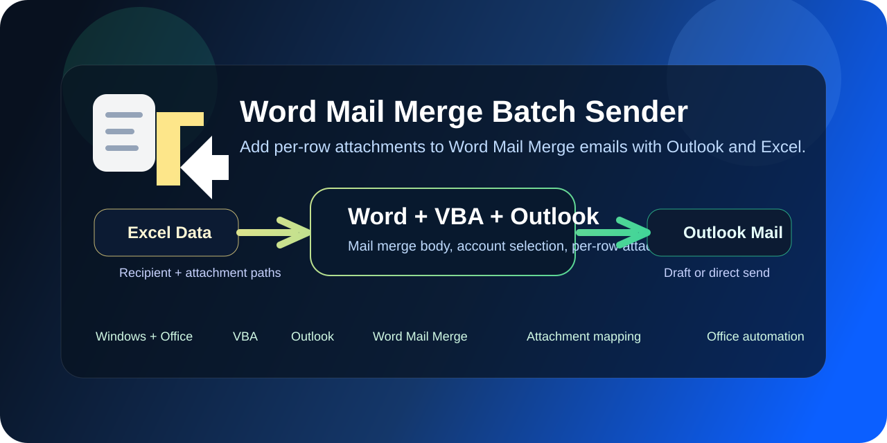

# Word Mail Merge Batch Sender

<p align="center">
  
</p>

<p align="center">
  
</p>

<p align="center"><strong>Add per-row attachments to Word Mail Merge emails with Outlook and Excel.</strong></p>

<p align="center">
  <a href="README.zh-CN.md">中文文档</a> · <a href="docs/architecture.md">Architecture</a> · <a href="docs/quickstart.md">Quick Start</a>
</p>


A practical Office VBA tool that extends Word Mail Merge so each outgoing email can include a different attachment based on the current Excel row.

## Why This Exists

Word Mail Merge is great for generating personalized email bodies, but it does not handle per-recipient attachments very well. In real office workflows, that missing step is often the most painful part.

This project keeps the familiar workflow:

- Word for template layout
- Excel for recipient data
- Outlook for delivery
- VBA for row-by-row attachment automation

## Best For

- Teachers sending homework, notices, or score reports
- HR and admin teams sending offers, forms, or onboarding files
- Finance or operations teams sending invoices, statements, or notices
- Anyone who already relies on Word, Excel, and Outlook

## Features

- Uses Word Mail Merge for personalized message bodies
- Reads recipient and attachment data from Excel
- Adds different attachments for different rows
- Lets you choose the Outlook sending account
- Supports direct send or draft mode
- Checks common problems before sending
- Shows errors more clearly than a manual workflow

## Quick Start

### Files

- `template/mail_template.docx`
- `example/sample_data.xlsx`
- `src/WordBatchMailSender.bas`

### Basic Workflow

1. Open the Word template.
2. Connect the template to the Excel file.
3. Insert Word mail merge fields.
4. Import `src/WordBatchMailSender.bas` into the VBA editor.
5. Run `BatchMailMergeSend`.
6. Choose the sender account, subject, and send mode.

## Project Structure

```text
word-mail-merge-batch-sender
├── assets/
│   ├── banner.svg
│   └── icon.svg
├── docs/
│   ├── architecture.md
│   ├── quickstart.md
│   ├── screenshot.png.placeholder.txt
│   └── troubleshooting.md
├── example/
│   └── sample_data.xlsx
├── src/
│   └── WordBatchMailSender.bas
├── template/
│   └── mail_template.docx
├── CHANGELOG.md
├── LICENSE
├── README.md
└── README.zh-CN.md
```

## Docs

- `README.zh-CN.md`
- `docs/architecture.md`
- `docs/quickstart.md`
- `docs/troubleshooting.md`

## Limitations

- Designed for Windows + Microsoft Office desktop workflows
- Depends on Outlook availability and local mail policies
- VBA macro permissions must be enabled in Office

## License

MIT

## DSH Edition

This project has a successor: [dsh-plugin-office](https://github.com/Xplore-LAB/dsh-plugin-office) — the same mail-merge capability (plus Word generation and spreadsheet pipelines) rebuilt as a native plugin for DeepSeek Harness, cross-platform, no Outlook COM required.
